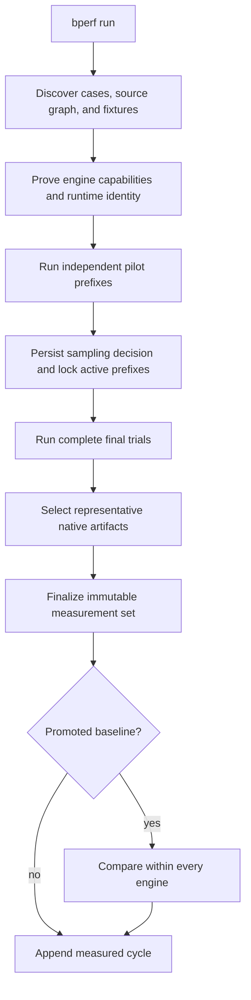
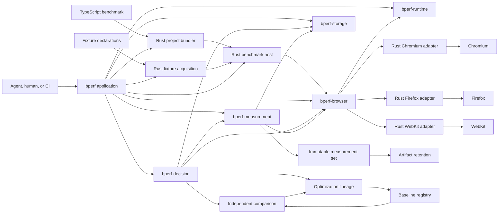

# bperf design

Status: the TypeScript authoring path, three-engine combined trials, retained
browser lanes, adaptive sampling, baseline comparison, runtime anchors,
optimization lineage, independent confirmation, and representative artifact
retention are implemented. Dedicated-worker and iframe execution contribute to
the same complete trial evidence on every engine. Tagged releases produce
cargo-binstall-compatible, target-triple archives whose executables carry the
pinned benchmark runtime.

This document describes the current design. The
[architecture decision records](adr/README.md) preserve the alternatives and
tradeoffs behind the parts most likely to be questioned later.

## The problem

bperf measures one implementation of a browser benchmark subject at a time,
stores that evidence as an immutable measurement set, and compares it with a
compatible historical baseline.

Two pressures shape most of the design.

The first is that browser performance work crosses engine boundaries. Chromium,
Firefox, and WebKit expose different profilers and heap formats, but a shared
benchmark still needs one reliable contract. Treating Playwright's public
protocol surface as the complete answer would make Chromium first-class and the
other engines optional.

The second is that a historical baseline is useful only when the work, source,
and runtime remain comparable. Reusing an old result saves a large amount of
browser time, but it introduces drift and selection risks that version strings
alone cannot settle.

bperf handles those pressures inside the measurement system. A benchmark author
should be able to describe the subject and its correct result without writing a
server, browser launcher, profiler adapter, sampling policy, or source-history
format.

## Goals

- Measure deterministic browser code in Chromium, Firefox, and WebKit.
- Capture wall timing, native CPU, Speedscope flamegraph, and native JavaScript
  heap evidence from one workload execution per trial.
- Include benchmark-owned dedicated workers and iframes in that evidence.
- Fail explicitly when a requested engine or artifact cannot satisfy the
  contract.
- Gate performance on correctness in every engine.
- Keep measurements and comparisons indexed by benchmark case and engine.
- Reuse immutable historical baselines while checking fresh runtime evidence.
- Record the exact project module graph that defined the measured bundle,
  including uncommitted work.
- Make interrupted measurements resumable without silently changing their
  schedule.
- Keep the common TypeScript authoring interface smaller than the machinery it
  hides.

## Non-goals

- Whole-process CPU, RSS, native heap, or operating-system energy measurement.
- Comparing absolute profiler values between browser engines.
- Pooling raw Chromium, Firefox, and WebKit values into a cross-engine average.
- Supervising an optimization agent or deciding which source edit it should
  make.
- General website navigation or page-load testing.
- Silently falling back to timing-only evidence when native capture fails.

## Domain language

- A **benchmark subject** is the behavior or code being evaluated.
- A **variant** is one concrete implementation or source state of that subject.
- A **workload** is the deterministic operations and inputs applied to a
  variant.
- A **benchmark case** fixes the subject, workload, engine, and environment
  configuration being compared.
- A **trial** runs one variant for a benchmark case.
- A **sample** is the wall, CPU, flamegraph, and heap evidence produced by one
  trial.
- A **capture scope** is one adapter-assigned group of native CPU, flamegraph,
  and heap artifacts. It preserves browser execution-realm evidence without
  becoming a statistical dimension.
- A **measurement set** contains immutable trial evidence for one variant.
- **Baseline** and **candidate** are comparison roles assigned to measurement
  sets. They are not properties of a benchmark definition.
- A **fixture** is a benchmark-owned resource exposed to browser code through a
  managed URL.
- An **optimization cycle** is one measured source change and its comparison.
- An **optimization lineage** is the append-only sequence of cycles,
  confirmations, reversions, and promotions for a benchmark.
- A **benchmark adapter** is the invocation glue between the measurement core
  and a browser workload. Its transport details are not part of the subject or
  statistics schemas.

For an hls.js MP4 benchmark, the parser is the subject, one source state is a
variant, and the media fragment plus parse call form the workload.

## Hard contracts

### Every engine is first-class

The core and benchmark authoring API do not expose CDP, Firefox RDP, Gecko
Profiler, Web Inspector, or Playwright-private objects.

```ts
type EngineId = "chromium" | "firefox" | "webkit";
```

Every requested engine must satisfy the same result shape:

| Capability | Chromium | Firefox | WebKit |
|---|---:|---:|---:|
| Isolated browser automation | Required | Required | Required |
| Native CPU profile | Required | Required | Required |
| Speedscope flamegraph | Required | Required | Required |
| Native JavaScript heap snapshot | Required | Required | Required |
| Dedicated-worker execution | Required | Required | Required |
| Iframe execution | Required | Required | Required |
| Clean close | Required | Required | Required |
| Artifact containment, size, and digest validation | Required | Required | Required |

A missing engine capability fails preflight. A child realm exposed in an
incompatible form fails the trial before evidence is accepted. The caller never
receives a successful three-engine result with one browser or artifact omitted.

Each capture scope contains all three native artifact kinds. Chromium and
WebKit can expose workers as separately profiled realms, while Firefox's native
profiler and heap actor cover the browser context. The public evidence preserves
those native boundaries, but CPU and heap scalars are aggregated into the one
sample for the benchmark case. Shared workers and service workers are not part
of the common contract; an adapter that exposes one as a separate target fails
instead of omitting it.

`browser.js_heap.allocated_bytes` is the one metric that departs from this
table: it carries an explicit per-engine support state instead of a preflight
failure, because the metric itself, not a required artifact, is what one
engine cannot yet produce. See "Allocated bytes" below.

### Correctness comes first

A faster candidate that returns the wrong result is negative, not improved.
Correctness is discovered and reported independently for every case and engine.
It is checked again in every captured trial.

### One measurement set contains one variant

Baseline and candidate evidence are collected independently. bperf never writes
both implementations into one measurement set and never mutates an old set to
turn it into a baseline.

### One trial produces one complete sample

Wall, CPU, flamegraph, and heap values remain related to the same workload
execution. A fixed count of `N` means `N` complete final trials for each case
and engine, not separate streams of timing, CPU, and heap runs.

## The authoring boundary

The TypeScript benchmark supplies:

- the operation to measure;
- representative inputs;
- the boundary between setup and measured work;
- the exact result that proves the operation stayed correct.

It does not supply:

- browser launch or protocol code;
- an HTTP server;
- profiler setup;
- iteration or sample counts;
- a variant descriptor for each source edit;
- a verifier process.

```ts
import {
  defineBrowserBenchmark,
  exact,
  fixture,
} from "bperf/browser";

import { parseFragmentStream } from "../../src/demux/mp4-parser.ts";

const fragment = fixture(
  "https://example.com/corpus/segment.mp4",
);

export default defineBrowserBenchmark({
  id: "hls-mp4-parser",

  cases: [
    {
      id: "stream-fragment",

      async measure() {
        const response = await fetch(fragment.url);
        if (!response.body) {
          throw new Error("fragment response has no body");
        }
        return parseFragmentStream(response.body);
      },

      expect: exact({
        boxes: ["ftyp", "moof", "mdat"],
        samples: 184,
        duration: 6.006,
      }),
    },
  ],
});
```

`setup()` runs outside timing and CPU capture. `measure()` represents one
semantic invocation. `settle()` runs after CPU capture and before the live heap
snapshot. The complete caller-facing contract is in
[Writing a benchmark](AUTHORING.md).

The current common path deliberately supports exact JSON expectations. Numeric
tolerances, schemas, and custom verifiers are not implied by this interface.
The advanced adapter remains available when exact JSON is not the right
correctness boundary.

## Project loading and variant identity

The benchmark imports project code normally. bperf creates an in-memory,
browser-targeted ESM bundle using the project's installed packages and
TypeScript configuration.

This boundary hides:

- TypeScript syntax;
- ESM and CommonJS interop;
- package exports and conditions;
- path aliases;
- browser bundle generation.

The bundle metadata provides the project source graph, including statically
resolvable dynamic imports. Variant identity also includes package manifests,
lockfiles, and TypeScript or JavaScript configuration that can change
resolution or emitted semantics.

A generic `implementation.load()` API was considered and rejected. It would
expose bperf plumbing while still requiring benchmark authors to understand
the subject's real module interface.

Projects that depend on custom build plugins, generated code, opaque runtime
imports, or production-only transforms use the advanced adapter until those
semantics can be represented without benchmark-specific options in the common
API.

[ADR 0003](adr/0003-browser-project-bundles.md) records why bperf bundles the
entry instead of recreating a browser bundler inside its file server.

## Fixtures

A fixture gives browser code a standard `URL`. It does not choose how that URL
is consumed.

```ts
const fragment = fixture("./fixtures/segment.mp4");

await fetch(fragment.url);
subject.load(fragment.url);
new Request(fragment.url);
```

Local files are hashed and served from a loopback origin. Remote URLs are
acquired outside measurement, stored by content hash, pinned in the
benchmark's fixture lock, and then served from the same loopback origin.

```text
remote source
    -> acquired body
    -> content-addressed object
    -> fixture lock
    -> loopback browser URL
```

The body and declared response behavior participate in benchmark identity.
Temporary ports and generated URLs do not.

The fixture server supports byte ranges, inferred or overridden content types,
and deterministic chunk size and delay. Unexpected non-loopback browser
traffic is blocked.

One wrinkle is that the current common path has no fixture-refresh command.
Pinned remote sources stay pinned. A new remote body needs a changed fixture
descriptor and a new baseline.

## Measurement lifecycle



The schedule is deterministic and resumable. Its database record contains the
maximum envelope of trials the policy may select. Pilot evidence determines a
prefix for each case and engine. Before final evidence begins, the sampling
record locks those pilot prefixes, the batch sizes, and the selected final
prefixes.

An interrupted run before that boundary recomputes the next deterministic
pilot from append-only evidence. A resumed run after that boundary validates
the recorded decision and runs only missing work. It does not recalibrate a
final trial.

## Browser lifecycle

Launching a browser is orchestration cost, not subject evidence. A fresh process
for every short trial made startup dominate the command, especially in
Firefox.

Each measurement set therefore keeps one retained browser lane for each engine.
A trial receives a new browser context and page, and that context is closed
before the next trial enters the lane.

This separates two concerns:

- process startup is amortized across the measurement set;
- cookies, storage, cache, service workers, page globals, and live JavaScript
  objects do not cross trial boundaries.

Trials execute serially inside an engine lane. A browser or protocol failure
invalidates the attempt and closes the lane. A retry launches a new browser
instead of continuing with uncertain engine state.

Baseline, candidate, and confirmation measurement sets never share browser
processes. [ADR 0004](adr/0004-retained-browser-lanes.md) records the measured
tradeoff behind this lifecycle.

## Trial and capture boundary

One captured trial follows this sequence:

1. Create a fresh browser context and page.
2. Run case setup outside the measured boundary.
3. Start the engine-native CPU profiler in every existing capture scope.
4. Run and time one calibrated workload batch.
5. Stop every CPU profiler.
6. Let the case settle.
7. Capture the live JavaScript heap for every retained capture scope.
8. Verify correctness and close the context.

The resulting sample contains:

- `workload.wall_ms`;
- `variant.call_wall_ms`;
- `browser.cpu_profile.active_ms`;
- `browser.js_heap.live_bytes`;
- `browser.js_heap.allocated_bytes`, on the engines that can capture it;
- one complete native CPU, Speedscope, and heap artifact group for every
  capture scope.

Wall and CPU scalars are normalized to one semantic invocation. The heap scalar
is not divided by the batch size; it describes the settled page and child
realms after the complete batch. Per-scope CPU durations and live heap sizes
are summed inside an engine before the scalar crosses the adapter boundary.

Wall timing is profiler-instrumented by design. Browser startup, setup,
settling, and heap-capture time are outside `workload.wall_ms`. The same
contract applies to baseline and candidate within an engine.

The CPU metric is restricted to activity attributed to the benchmark target.
The heap metric is derived from the retained native snapshot. The benchmark
bundle is served without a source map, so the retained heap does not carry a
map data URL that grows with the bundled source text. Neither claims to
measure whole-process CPU, RSS, native allocation, or browser-network-process
work.

Every explicitly scheduled warmup, pilot, and final trial uses this capture
contract. The managed TypeScript path does not schedule separate warmup trials;
pilot sizing already warms the retained lane.

[ADR 0005](adr/0005-combined-final-trials.md) records why timing, CPU, and heap
are captured around one execution rather than scheduled as independent streams.

### Allocated bytes

`browser.js_heap.allocated_bytes` is bytes allocated on the page's JS heap
during the calibrated batch, divided by batch size the way `cpu_active_ms` is.
It is not attributed to benchmark frames, so it includes the harness's
per-call result serialization; that cost is constant across baseline and
candidate. Unlike `browser.js_heap.live_bytes`, which is a snapshot taken
after a forced GC, this metric counts what the batch allocated even if the
collector reclaimed it before the snapshot, which is the only way to see a
change in garbage generated rather than garbage retained.

The metric has a resolution floor of one Chromium sampling interval (128 KB
per batch): a batch whose captured allocation lands below the floor is
reported as exactly the floor on every engine. A workload that allocates
almost nothing would otherwise read zero on Chromium only when no allocation
sample happened to land, which is a coin flip rather than a measurement; the
floor makes sub-resolution workloads read one deterministic value everywhere.

Support is explicit per engine rather than pooled or silently downgraded:

- Chromium: `sum(selfSize)` over the CDP `HeapProfiler` sampling heap profile
  taken across the batch, 128 KB sampling interval, with objects collected by
  major and minor GC both included.
- Firefox: `sum(GCMinor.nursery.bytes_used)` from the Gecko Profiler markers
  on the content process's main thread, with forced-GC bookends so the
  nursery is empty at both ends of the batch. Direct tenured allocations only
  report a cell count, not bytes, so they are excluded from the sum; the
  metric undercounts by that share.
- WebKit: unsupported. The pinned Web Inspector protocol has no
  `Heap.getStatistics` command, so there is no way to read allocated bytes
  without a wall-time-tripling `JSC_gcMaxHeapSize` workaround. Tracked
  upstream at [bperf issue #4](https://github.com/itsjamie/bperf/issues/4).

A trial that cannot capture the metric records an explicit reason instead of
a value or a zero. `bperf doctor`, the run summary, and both TUIs render
`n/a (unsupported: reason)` for that engine rather than a number, and
`analyze_engine` builds its effects only from metrics the engine supports, so
verdict semantics are unaffected by an engine that cannot report it.

`bperf doctor` also checks the Chromium sampler's wall cost on each host. It
runs a fixed allocation workload once with the sampler off and once with it
on, reports both median wall times, and warns when the sampled run is more
than 5% slower, the minimum effect the decision policy resolves. Firefox and
WebKit run no sampler inside the timed batch, so the doctor reports the check
as not applicable for them.

## Native browser adapters

All engines use browser archives published for one pinned Playwright version.
An authenticated Rust maintenance job verifies the npm registry signature and
signed SHA-512 integrity of `playwright-core`, extracts its static distribution
data without executing package JavaScript, and emits the checked-in registry
embedded in the executable. The compiled registry owns revisions, platform
overrides, download URLs, archive layout, Linux dependencies, and installation.
CI regenerates it from the signed package and rejects drift. Rust also owns each
browser process and native capture adapter. Playwright WebKit is not the
installed Safari application.

| Concern | Chromium | Firefox | WebKit |
|---|---|---|---|
| Adapter owner | Rust | Rust | Rust |
| Automation | CDP remote-debugging pipe | Juggler pipe | Inspector pipe to patched WebKit |
| CPU | CDP `Profiler` | Gecko Profiler through RDP | Web Inspector `ScriptProfiler` |
| JavaScript heap | CDP `HeapProfiler` | RDP `MemoryActor` | Web Inspector `Heap` |
| Allocated bytes | CDP `HeapProfiler.startSampling`, 128 KB | RDP Gecko Profiler `GCMinor` markers | unsupported, no `Heap.getStatistics` |
| Flamegraph | V8 samples to Speedscope | Gecko tables to Speedscope | Inspector samples to Speedscope |
| Capture scopes | Page plus separately attached dedicated workers and OOPIFs | One browser context containing page, iframe, and DOM-worker evidence | Page, including iframe work, plus each nested dedicated worker |

Raw captures stay in their native formats. Speedscope is a common viewer, not a
claim that the profilers have identical semantics.

The Firefox adapter reads the `.fxsnapshot` core-dump framing and sums every
node's shallow size in the live heap graph. Protocol memory-report buckets are
not substituted for the snapshot metric.

The Rust Chromium adapter owns its CDP sessions, target attachment, request
interception, V8 capture sequencing, and normalization. The Rust Firefox
adapter owns its Juggler sessions, RDP actors, Gecko profile normalization, and
`.fxsnapshot` lifecycle. The Rust WebKit adapter owns its pinned private
inspector bridge. They share only process containment, pinned browser
installation discovery, browser-workload policy, immutable artifact
description, and
Speedscope document construction. The capture-artifact module prepares three
contained output paths for each capture scope, replaces stale files, and
returns complete validated descriptor groups. Each adapter still decides which
native payload, samples, and frames belong in an artifact; engine protocol
concepts stay inside the adapter. A child realm created while profiling is
paused until its profiler starts where the engine permits that sequencing. A
realm lost before its complete artifact group is captured invalidates the
attempt. A mismatch closes the retained lane and fails preflight or the current
attempt; no adapter falls back to Node.
Shutdown succeeds only after the owned Unix process group is absent or the
Windows Job Object reports zero active processes. The live contract also proves
that repeated captures keep one root PID for each healthy retained lane.

One versioned JavaScript workload source owns setup, adaptive batch selection,
result stability, timing, settling, the runtime anchor, and the doctor probe.
Every Rust adapter embeds it, so those semantics are not reimplemented per
engine.

[ADR 0007](adr/0007-rust-browser-adapters.md) records the unified Rust
ownership decision and retirement of the former TypeScript capture path.
[ADR 0008](adr/0008-child-execution-realms.md) records why child realms use
native artifact scopes rather than becoming benchmark cases.

Checked-in golden captures exercise each native parser and Speedscope
normalizer in the fast suite. The ignored real-browser contract tests prove the
complete live route.

## Adaptive sampling

Benchmark authors do not choose iterations or final sample counts.

The managed policy starts with unprofiled sizing probes that grow a workload
batch toward 100 milliseconds, capped at 10,000 invocations. Batching keeps
coarse browser timers and sparse CPU samples from overwhelming short but valid
subjects.

For each case and engine, bperf then:

1. records complete pilot samples and end-to-end trial cost;
2. checks stability after five pilots;
3. continues an unstable stratum independently, up to ten pilots;
4. chooses the median batch size from the selected pilot prefix;
5. estimates the final count required by every primary metric;
6. uses the strictest metric's count as the complete final-trial count;
7. allocates between 20 and 100 final trials within the remaining budget;
8. preserves the minimum evidence floor when the requested budget is too
   short.

Pilot stability includes the required final count, selected batch size, and
complete-trial cost across the latest three cumulative prefixes. A noisy
Firefox case can continue without forcing more Chromium or WebKit pilots.

Baseline and candidate sets may select different final counts. The comparator
therefore uses independent two-sample statistics rather than paired analysis.

[ADR 0006](adr/0006-adaptive-calibration.md) records why sizing probes replaced
separate captured warmups and why pilot strata stop independently.

## Correctness and isolation

Before planning a measurement set, bperf invokes every case once in disposable
state on every engine. That discovery pass:

- proves the benchmark definition is engine-independent;
- pins fixtures;
- verifies the exact result;
- proves the browser bundle can execute the case in every engine.

Every captured trial verifies the result again. Repeated calls inside a
calibrated batch must return the same serialized value.

An unexpected request, browser crash, profiler failure, malformed response, or
incomplete artifact invalidates the attempt. A valid expectation mismatch is a
correctness result and remains in the evidence.

Correctness reporting stays separated by case and engine and includes valid
trials, attempts, success interval, failure categories, and invalid-attempt
counts.

The common lifecycle assumes a repeatable operation in disposable page state.
Stateful leak-growth and externally single-shot workloads need an explicit
future lifecycle. They should not approximate one with globals that weaken
trial isolation.

## Comparison

Comparison is pure analysis over two compatible measurement sets. It requires:

- the same benchmark subject and resolved workload;
- the same fixture and response identity;
- compatible environment fingerprints;
- matching case and engine strata;
- valid measurement and trial schemas.

Baseline and candidate observations are resampled independently with a
two-sample hierarchical bootstrap inside each case and engine.

Every reported effect remains indexed by:

```text
case × engine × metric
```

Raw measurements and percentage effects are never averaged across engines.
Chromium, Firefox, and WebKit are allowed to disagree.

The overall verdict is a categorical fold:

- any negative required engine makes the result negative;
- otherwise any inconclusive engine makes it inconclusive;
- positive requires every engine to satisfy the strict improvement policy;
- the remaining accepted result is equivalent.

The report names the engine, browser build, case, and metric that blocked a
promotion.

Compact baseline and candidate values are workload-weighted geometric point
estimates. The unit is selected once per pair from `ns`, `us`, `ms`, and `s`
for time or `b` and `kb` for heap, so the displayed values agree with the
reported percentage.

## Historical baseline validity

Reusing a baseline avoids measuring it after every edit, but exact runtime
identity cannot prove that the host is performing consistently. Thermal state,
virtualization, background load, and operating-system behavior can move timing
and sampled CPU without changing version strings.

Every measurement set carries:

- one Rust-captured host identity;
- exact browser identity for each engine;
- exact per-engine adapter identity: executable digest, Playwright version,
  pinned revision, and adapter protocol version for Chromium, Firefox, and
  WebKit;
- 31 fresh observations of a versioned JavaScript CPU anchor in every engine.

The comparator bootstraps the historical-to-fresh median anchor change for each
engine. The anchor is stable only when its 95% interval is wholly inside ±5%.
Drifted, inconclusive, or missing anchor evidence makes performance
inconclusive for that engine. Correctness failures remain negative.

Baseline age is reported and warns after seven days. Age alone does not reject
a comparison whose exact identity and fresh anchor remain acceptable.

Repeated candidate search introduces another risk: the apparent winner may be
partly selected from measurement noise. After five cycles compare candidates
with one baseline, promotion requires an independent measurement of the
unchanged candidate:

```text
bperf confirm <benchmark.ts> [<cycle-selector>]
bperf accept [<cycle-selector>]
```

Confirmation uses a distinct resumable identity and is recorded as a lineage
event, not another source-change cycle. Historical, candidate, anchor, and
confirmation samples are never concatenated.

Promotion readiness is computed once, inside the lineage module, from the
event stream that includes the newly recorded cycle or confirmation. `run`,
`confirm`, and `show` report it as the next command (`accept` or `confirm`)
and as a `promotion_readiness` JSON field, so the confirmation requirement is
visible before `accept` refuses. New cycles record the workspace-relative
benchmark module so that command is complete; cycles recorded before the field
existed keep a placeholder.

[ADR 0001](adr/0001-runtime-validity.md) records the rejected design that tried
to reconstruct and rerun old source.

## Artifact retention

Every trial needs native CPU and heap payloads to derive its scalar metrics.
Keeping every payload forever would make storage grow with the statistical
sample count.

After final evidence completes, bperf selects representative trials
independently for each case and engine:

- every CPU profile and flamegraph scope comes from the final trial nearest
  median CPU;
- every heap snapshot scope comes from the final trial nearest median live
  heap;
- ties use the stable trial identifier.

The retention record stores each selection and the aggregate retained and
discarded counts before cleanup begins. Every trial record keeps the original
path, size, format, and SHA-256 descriptor even when an unselected payload is
removed.

CPU and heap representatives may come from different trials because they
represent different distributions. Once a representative trial is chosen,
retention keeps that artifact kind for all of its capture scopes.

Failed and interrupted measurements keep preflight captures and frozen workload
inputs needed for resumption. Completed measurements remove those scratch
directories only after the measurement summary and retention record are
durable.

[ADR 0002](adr/0002-artifact-retention.md) records why cleanup waits until the
completed distribution can choose a representative.

## Optimization lineage

Every completed `bperf run` appends one cycle. A cycle binds:

- the immutable candidate measurement set;
- the promoted baseline used for comparison, if any;
- the engine-specific comparison summary;
- a content-addressed checkpoint of the project graph that defined the
  measured browser bundle;
- a reconstructable change from the previous measured cycle;
- the caller's short hypothesis or description.

Source history is independent of Git. It includes uncommitted and untracked
files that participated in the measured graph. It does not record edits that
were never followed by a completed run.

Before recording a cycle, bperf reads the source graph twice and requires both
state identities to match. It recomputes the variant identity and checks it
against the completed measurement. An edit racing that checkpoint fails instead
of attaching the wrong source to valid evidence.

Changes are computed from the previous measured cycle, not from the current
baseline. Negative ideas, equivalent results, inconclusive runs, and explicit
reversions therefore remain in order.

An exact retry of the latest source, measurement, and comparison is idempotent.
Returning to an older source state after another cycle produces a new reversion
cycle.

```text
bperf history [<benchmark-id>]
bperf history [<benchmark-id>] --format agent-context
bperf show [<cycle-selector>] [--benchmark <benchmark-id>] --diff
bperf confirm <benchmark.ts> [<cycle-selector>]
bperf accept [<cycle-selector>] [--benchmark <benchmark-id>]
```

With no history arguments and an attached input/output terminal, `history`
loads a compact database overview of the latest benchmark, then reads the
selected cycle's persisted evidence projection. Details are cached as the
selection moves. Navigation does not reopen measurements, hash retained
profiles, or reconstruct source changes. `show` reads the same evidence
projection for one cycle and lists its retained artifact descriptors grouped
by engine, so non-interactive callers reach profiles without the terminal
view; a cycle recorded before evidence persistence simply has no artifact
section.
The application owns terminal layout, keyboard state, filters, and artifact
launching; the lineage module supplies terminal-neutral benchmark, cycle,
baseline, environment, comparison, change, promotion, and retained-artifact
summaries. An explicit benchmark or `--format`, and every redirected invocation,
keeps the existing non-interactive output contract.

`accept` promotes the cycle's candidate and appends a promotion event. Accepting
an older cycle later records another promotion and restores that measured state
as the comparison baseline.

The lower-level `baseline promote` command updates the evidence registry without
inventing an optimization cycle. It remains available for advanced workflows.

## Architecture



The Cargo graph is one-way. Each public Module has an explicit Interface and
hides knowledge that would otherwise spread through the application:

| Crate / Module | Interface and hidden knowledge |
|---|---|
| `bperf` application | `doctor`, `run`, and `confirm` orchestration. It composes the library Interfaces but is not a dependency of them. |
| `bperf-runtime::installation` | Pinned browser selection and installation. Playwright version, revisions, platform archives, executable paths, cache conventions, atomic extraction, and Linux packages stay private. |
| `bperf-storage` | Canonical SQLite connections, schema versioning, immutable documents, ordered events, cross-domain transactions, and atomic publication for external payloads. Domain schemas and identities stay with callers. |
| `bperf-browser::lab` | Engine-neutral configurations and evidence, retained lane lifecycle, complete capture validation, and managed benchmark inspection. |
| `bperf-browser::artifacts` | Complete per-scope artifact-set and file validation. Construction helpers and Speedscope representation stay crate-private. |
| Private browser Modules | Chromium CDP, Firefox Juggler/RDP, WebKit inspector protocol, native formats, workload injection, and process containment. |
| `bperf-measurement::manifest` | Benchmark and variant definitions. |
| `bperf-measurement::schedule` | Deterministic fixed and adaptive trial schedules. |
| `bperf-measurement::sampling` | Pilot stopping, batch selection, final-count sizing, and immutable sampling decisions. |
| `bperf-measurement::store` | One-variant measurement-set preparation, resumption, evidence recording, frozen workloads, environment records, and finalization. Measurement paths and schemas stay private. |
| `bperf-measurement::retention` | Representative artifact selection and resumable payload cleanup. |
| `bperf-decision::environment` | Host and adapter identity plus versioned per-engine runtime anchors. |
| `bperf-decision::comparison` | Compatibility checks, independent statistics, guardrails, and strict engine-level verdict folding. |
| `bperf-decision::baseline` | Append-only current-baseline references. |
| `bperf-decision::lineage` | Content-addressed source states, deltas, cycles, confirmations, and promotions. |
| `managed_benchmark` | The common `run` and `confirm` workflows, two-pass cross-engine discovery, generated private inputs, comparison attachment, and cycle recording. |
| `benchmark_host` | Concurrent loopback serving of one validated browser bundle and validated fixture bodies, including byte-range and paced-stream responses. |
| `project_modules` | Rolldown-backed TypeScript, package, CommonJS, alias, and browser-bundle resolution plus materialized bundle identity. |
| `fixtures` | Local project containment, HTTPS acquisition and redirects, content-addressed body caching, pinned-remote reuse, and immutable fixture-lock validation. |
| `benchmark_runtime` | The prepared workload and verifier contract used by the measurement engine. |
| `runner` | Resumable progression of pending attempts into terminal trial evidence. |

Different layers expose different abstractions. The Rust core receives
validated capture evidence, not browser protocol objects. The benchmark author
supplies a domain operation, not generated YAML or a transport endpoint.

Managed discovery serves the unresolved bundle and compares descriptions from
Chromium, Firefox, and WebKit. After fixture resolution locks the inputs,
it serves the resolved bundle, compares descriptions again, and exercises every
case in a fresh context on every engine. Rolldown inlines the browser authoring
module into one materialized ESM bundle. A Rust loopback host serves that bundle
and the locked fixture bodies during both discovery and every trial. Rust also
acquires local or remote fixture bodies and finalizes the lock between the two
discovery passes.

The browser authoring module and registry are compiled into the executable.
`bperf browsers install` downloads the selected upstream archives over HTTPS,
validates their paths and expected executable, preserves native permissions,
and activates each cache directory atomically. Linux `--with-deps` installs the
package set fixed by the same registry. Browser binaries remain separate
because they are platform-specific and substantially larger than bperf.

Capture protocol 14, benchmark-host protocol 2, environment schema 6,
measurement schema 6, and doctor schema 3 identify the allocation-metric-capable
ownership model. Each Rust adapter protocol is version 3. Environment and
measurement records from earlier capture shapes require remeasurement.

## CLI

The common interface is:

```text
bperf doctor [--engine chromium|firefox|webkit|all]
bperf browsers install [--engine chromium|firefox|webkit|all] [--with-deps]
bperf run [<benchmark.ts|directory>] [--budget <duration>] [--message <text>] [--json]
bperf confirm <benchmark.ts> [<cycle-selector>] [--budget <duration>] [--json]
bperf history [<benchmark-id>] [--format text|json|agent-context]
bperf show [<cycle-selector>] [--benchmark <benchmark-id>] [--diff] [--json]
bperf accept [<cycle-selector>] [--benchmark <benchmark-id>] [--json]
```

Cycle selectors default to the latest local cycle and accept a unique ID
prefix. An unscoped `latest` resolves across every measured benchmark; `show`
and `accept` name the selected benchmark in their output and print a stderr
notice when other benchmark streams exist, and `--benchmark` restricts them to
one stream. `confirm` resolves its selector after the module is materialized,
scoped to that module's benchmark, so it cannot confirm another benchmark's
cycle. Generated state is rooted at `.bperf` by default; one global
`--data-dir <directory>` option relocates it without exposing the internal
storage layout. With a terminal, omitting the `run` target opens the recursive
`benchmarks` picker; a directory opens the same picker at that subtree. An
exact benchmark module always uses the direct command path.

The advanced evidence interface remains:

```text
bperf validate <benchmark.yaml> [--variant <variant.yaml>]
bperf plan <benchmark.yaml> <variant.yaml> [--final-samples <N>]
bperf measure <benchmark.yaml> <variant.yaml> [--final-samples <N>]
bperf compare <candidate-set> [--baseline <baseline-set>]
bperf baseline promote <measurement-set>
bperf baseline show <benchmark-id>
```

Repeating an interrupted operation resumes compatible pending evidence.

## Advanced adapter

The advanced path uses:

- a benchmark YAML specification;
- one variant descriptor;
- a command that starts a loopback adapter server;
- one stdout readiness object;
- `globalThis.__bperf.run(operation)` in the page;
- JSONL operations;
- the built-in exact verifier or an independent verifier process.

This protocol proved the workload and three-engine capture design before the
TypeScript authoring layer existed. It remains useful when a project cannot fit
the common bundle or correctness boundary.

Normal benchmark authors should not implement it. Keeping the protocol behind
`benchmark_runtime` prevents transport and verifier details from leaking into
measurement, comparison, or lineage.

## Data layout

```text
.bperf/
|-- bperf.sqlite3
|-- objects/
|   `-- <fixture-sha256>
|-- managed/
|   `-- <benchmark-path-key>/
|       |-- fixture-lock.json
|       |-- benchmark.json
|       |-- variant.json
|       `-- workloads/
|-- measurements/
|   `-- <measurement-set-id>/
|       |-- workloads/
|       `-- artifacts/
`-- lineages/
    `-- objects/
        `-- <source-sha256>
```

`bperf.sqlite3` is canonical for resolved definitions, schedules, sampling,
environments, trials and metrics, retention, comparisons, baseline and lineage
events, source metadata, history projections, and chronological run receipts.
Files under `managed/` are generated browser-adapter inputs, not an authoring
interface or a second history store. Fixture and source payloads use different
directories because their identities and retention policies are different.

Structured state has no file-format fallback or dual write. A database with an
unsupported schema fails explicitly. JSON remains available from command
`--json` output.

## Open questions

Two common-path decisions remain deliberately unresolved:

1. What lifecycle should represent stateful, single-shot, or leak-growth cases
   without weakening trial isolation?
2. Which additional fixture response behaviors are general enough to expose
   without turning the benchmark API into an HTTP-server configuration format?

Until those interfaces have a clear answer, the advanced adapter owns the
exception.
