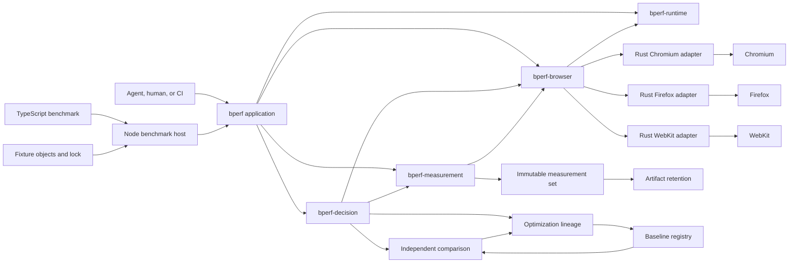

# bperf design

Status: the TypeScript authoring path, three-engine combined trials, retained
browser lanes, adaptive sampling, baseline comparison, runtime anchors,
optimization lineage, independent confirmation, and representative artifact
retention are implemented.

This document describes the current design. The
[architecture decision records](adr/README.md) preserve the alternatives and
tradeoffs behind the parts most likely to be questioned later.

## The problem

bperf measures one implementation of a browser benchmark subject at a time,
stores that evidence as an immutable measurement set, and compares it with a
compatible historical baseline.

Two pressures shape most of the design.

The first is that browser performance work crosses engine boundaries. Chromium,
Firefox, and WebKit expose different profilers and heap formats, but a shared
benchmark still needs one reliable contract. Treating Playwright's public
protocol surface as the complete answer would make Chromium first-class and the
other engines optional.

The second is that a historical baseline is useful only when the work, source,
and runtime remain comparable. Reusing an old result saves a large amount of
browser time, but it introduces drift and selection risks that version strings
alone cannot settle.

bperf handles those pressures inside the measurement system. A benchmark author
should be able to describe the subject and its correct result without writing a
server, browser launcher, profiler adapter, sampling policy, or source-history
format.

## Goals

- Measure deterministic browser code in Chromium, Firefox, and WebKit.
- Capture wall timing, native CPU, Speedscope flamegraph, and native JavaScript
  heap evidence from one workload execution per trial.
- Fail explicitly when a requested engine or artifact cannot satisfy the
  contract.
- Gate performance on correctness in every engine.
- Keep measurements and comparisons indexed by benchmark case and engine.
- Reuse immutable historical baselines while checking fresh runtime evidence.
- Record the exact project module graph that defined the measured bundle,
  including uncommitted work.
- Make interrupted measurements resumable without silently changing their
  schedule.
- Keep the common TypeScript authoring interface smaller than the machinery it
  hides.

## Non-goals

- Whole-process CPU, RSS, native heap, or operating-system energy measurement.
- Comparing absolute profiler values between browser engines.
- Pooling raw Chromium, Firefox, and WebKit values into a cross-engine average.
- Supervising an optimization agent or deciding which source edit it should
  make.
- General website navigation or page-load testing.
- Silently falling back to timing-only evidence when native capture fails.

## Domain language

- A **benchmark subject** is the behavior or code being evaluated.
- A **variant** is one concrete implementation or source state of that subject.
- A **workload** is the deterministic operations and inputs applied to a
  variant.
- A **benchmark case** fixes the subject, workload, engine, and environment
  configuration being compared.
- A **trial** runs one variant for a benchmark case.
- A **sample** is the wall, CPU, flamegraph, and heap evidence produced by one
  trial.
- A **measurement set** contains immutable trial evidence for one variant.
- **Baseline** and **candidate** are comparison roles assigned to measurement
  sets. They are not properties of a benchmark definition.
- A **fixture** is a benchmark-owned resource exposed to browser code through a
  managed URL.
- An **optimization cycle** is one measured source change and its comparison.
- An **optimization lineage** is the append-only sequence of cycles,
  confirmations, reversions, and promotions for a benchmark.
- A **benchmark adapter** is the invocation glue between the measurement core
  and a browser workload. Its transport details are not part of the subject or
  statistics schemas.

For an hls.js MP4 benchmark, the parser is the subject, one source state is a
variant, and the media fragment plus parse call form the workload.

## Hard contracts

### Every engine is first-class

The core and benchmark authoring API do not expose CDP, Firefox RDP, Gecko
Profiler, Web Inspector, or Playwright-private objects.

```ts
type EngineId = "chromium" | "firefox" | "webkit";
```

Every requested engine must satisfy the same result shape:

| Capability | Chromium | Firefox | WebKit |
|---|---:|---:|---:|
| Isolated browser automation | Required | Required | Required |
| Native CPU profile | Required | Required | Required |
| Speedscope flamegraph | Required | Required | Required |
| Native JavaScript heap snapshot | Required | Required | Required |
| Clean close | Required | Required | Required |
| Artifact containment, size, and digest validation | Required | Required | Required |

A missing capability fails preflight. The caller never receives a successful
three-engine result with one browser or artifact omitted.

### Correctness comes first

A faster candidate that returns the wrong result is negative, not improved.
Correctness is discovered and reported independently for every case and engine.
It is checked again in every captured trial.

### One measurement set contains one variant

Baseline and candidate evidence are collected independently. bperf never writes
both implementations into one measurement set and never mutates an old set to
turn it into a baseline.

### One trial produces one complete sample

Wall, CPU, flamegraph, and heap values remain related to the same workload
execution. A fixed count of `N` means `N` complete final trials for each case
and engine, not separate streams of timing, CPU, and heap runs.

## The authoring boundary

The TypeScript benchmark supplies:

- the operation to measure;
- representative inputs;
- the boundary between setup and measured work;
- the exact result that proves the operation stayed correct.

It does not supply:

- browser launch or protocol code;
- an HTTP server;
- profiler setup;
- iteration or sample counts;
- a variant descriptor for each source edit;
- a verifier process.

```ts
import {
  defineBrowserBenchmark,
  exact,
  fixture,
} from "bperf/browser";

import { parseFragmentStream } from "../../src/demux/mp4-parser.ts";

const fragment = fixture(
  "https://example.com/corpus/segment.mp4",
);

export default defineBrowserBenchmark({
  id: "hls-mp4-parser",

  cases: [
    {
      id: "stream-fragment",

      async measure() {
        const response = await fetch(fragment.url);
        if (!response.body) {
          throw new Error("fragment response has no body");
        }
        return parseFragmentStream(response.body);
      },

      expect: exact({
        boxes: ["ftyp", "moof", "mdat"],
        samples: 184,
        duration: 6.006,
      }),
    },
  ],
});
```

`setup()` runs outside timing and CPU capture. `measure()` represents one
semantic invocation. `settle()` runs after CPU capture and before the live heap
snapshot. The complete caller-facing contract is in
[Writing a benchmark](AUTHORING.md).

The current common path deliberately supports exact JSON expectations. Numeric
tolerances, schemas, and custom verifiers are not implied by this interface.
The advanced adapter remains available when exact JSON is not the right
correctness boundary.

## Project loading and variant identity

The benchmark imports project code normally. bperf creates an in-memory,
browser-targeted ESM bundle using the project's installed packages and
TypeScript configuration.

This boundary hides:

- TypeScript syntax;
- ESM and CommonJS interop;
- package exports and conditions;
- path aliases;
- browser bundle generation.

The bundle metadata provides the project source graph, including statically
resolvable dynamic imports. Variant identity also includes package manifests,
lockfiles, and TypeScript or JavaScript configuration that can change
resolution or emitted semantics.

A generic `implementation.load()` API was considered and rejected. It would
expose bperf plumbing while still requiring benchmark authors to understand
the subject's real module interface.

Projects that depend on custom build plugins, generated code, opaque runtime
imports, or production-only transforms use the advanced adapter until those
semantics can be represented without benchmark-specific options in the common
API.

[ADR 0003](adr/0003-browser-project-bundles.md) records why bperf bundles the
entry instead of recreating a browser bundler inside its file server.

## Fixtures

A fixture gives browser code a standard `URL`. It does not choose how that URL
is consumed.

```ts
const fragment = fixture("./fixtures/segment.mp4");

await fetch(fragment.url);
subject.load(fragment.url);
new Request(fragment.url);
```

Local files are hashed and served from a loopback origin. Remote URLs are
acquired outside measurement, stored by content hash, pinned in the
benchmark's fixture lock, and then served from the same loopback origin.

```text
remote source
    -> acquired body
    -> content-addressed object
    -> fixture lock
    -> loopback browser URL
```

The body and declared response behavior participate in benchmark identity.
Temporary ports and generated URLs do not.

The fixture server supports byte ranges, inferred or overridden content types,
and deterministic chunk size and delay. Unexpected non-loopback browser
traffic is blocked.

One wrinkle is that the current common path has no fixture-refresh command.
Pinned remote sources stay pinned. A new remote body needs a changed fixture
descriptor and a new baseline.

## Measurement lifecycle


The schedule is deterministic and resumable. `schedule.json` contains the
maximum envelope of trials the policy may select. Pilot evidence determines a
prefix for each case and engine. Before final evidence begins,
`sampling.json` locks those pilot prefixes, the batch sizes, and the selected
final prefixes.

An interrupted run before that boundary recomputes the next deterministic
pilot from append-only evidence. A resumed run after that boundary validates
the recorded decision and runs only missing work. It does not recalibrate a
final trial.

## Browser lifecycle

Launching a browser is orchestration cost, not subject evidence. A fresh process
for every short trial made startup dominate the command, especially in
Firefox.

Each measurement set therefore keeps one retained browser lane for each engine.
A trial receives a new browser context and page, and that context is closed
before the next trial enters the lane.

This separates two concerns:

- process startup is amortized across the measurement set;
- cookies, storage, cache, service workers, page globals, and live JavaScript
  objects do not cross trial boundaries.

Trials execute serially inside an engine lane. A browser or protocol failure
invalidates the attempt and closes the lane. A retry launches a new browser
instead of continuing with uncertain engine state.

Baseline, candidate, and confirmation measurement sets never share browser
processes. [ADR 0004](adr/0004-retained-browser-lanes.md) records the measured
tradeoff behind this lifecycle.

## Trial and capture boundary

One captured trial follows this sequence:

1. Create a fresh browser context and page.
2. Run case setup outside the measured boundary.
3. Start the engine-native CPU profiler.
4. Run and time one calibrated workload batch.
5. Stop the CPU profiler.
6. Let the case settle.
7. Run the supported collection sequence and capture the live JavaScript heap.
8. Verify correctness and close the context.

The resulting sample contains:

- `workload.wall_ms`;
- `variant.call_wall_ms`;
- `browser.cpu_profile.active_ms`;
- `browser.js_heap.live_bytes`;
- a native CPU profile;
- a Speedscope flamegraph derived from that profile;
- a native heap snapshot.

Wall and CPU scalars are normalized to one semantic invocation. The heap scalar
is not divided by the batch size; it describes the settled page after the
complete batch.

Wall timing is profiler-instrumented by design. Browser startup, setup,
settling, and heap-capture time are outside `workload.wall_ms`. The same
contract applies to baseline and candidate within an engine.

The CPU metric is restricted to activity attributed to the benchmark target.
The heap metric is derived from the retained native snapshot. Neither claims to
measure whole-process CPU, RSS, native allocation, or browser-network-process
work.

Every explicitly scheduled warmup, pilot, and final trial uses this capture
contract. The managed TypeScript path does not schedule separate warmup trials;
pilot sizing already warms the retained lane.

[ADR 0005](adr/0005-combined-final-trials.md) records why timing, CPU, and heap
are captured around one execution rather than scheduled as independent streams.

## Native browser adapters

All engines use builds pinned by the sidecar's Playwright package. Rust owns
each browser process and native capture adapter. Playwright WebKit is not the
installed Safari application.

| Concern | Chromium | Firefox | WebKit |
|---|---|---|---|
| Adapter owner | Rust | Rust | Rust |
| Automation | CDP remote-debugging pipe | Juggler pipe | Inspector pipe to patched WebKit |
| CPU | CDP `Profiler` | Gecko Profiler through RDP | Web Inspector `ScriptProfiler` |
| JavaScript heap | CDP `HeapProfiler` | RDP `MemoryActor` | Web Inspector `Heap` |
| Flamegraph | V8 samples to Speedscope | Gecko tables to Speedscope | Inspector samples to Speedscope |

Raw captures stay in their native formats. Speedscope is a common viewer, not a
claim that the profilers have identical semantics.

The Firefox adapter reads the `.fxsnapshot` core-dump framing and sums every
node's shallow size in the live heap graph. Protocol memory-report buckets are
not substituted for the snapshot metric.

The Rust Chromium adapter owns its CDP sessions, target attachment, request
interception, V8 capture sequencing, and normalization. The Rust Firefox
adapter owns its Juggler sessions, RDP actors, Gecko profile normalization, and
`.fxsnapshot` lifecycle. The Rust WebKit adapter owns its pinned private
inspector bridge. They share only process containment, Playwright installation
discovery, browser-workload policy, immutable artifact description, and
Speedscope document construction. The capture-artifact module also prepares the
engine's three contained output paths, replaces stale files, and returns a
complete validated descriptor set. Each adapter still decides which native
payload, samples, and frames belong in an artifact; engine protocol concepts
stay inside the adapter. A mismatch closes the retained lane and fails
preflight or the current attempt; no adapter falls back to Node.
Shutdown succeeds only after the owned Unix process group is absent or the
Windows Job Object reports zero active processes. The live contract also proves
that repeated captures keep one root PID for each healthy retained lane.

One versioned JavaScript workload source owns setup, adaptive batch selection,
result stability, timing, settling, the runtime anchor, and the doctor probe.
Every Rust adapter embeds it, so those semantics are not reimplemented per
engine.

[ADR 0007](adr/0007-rust-browser-adapters.md) records the unified Rust
ownership decision and retirement of the former TypeScript capture path.

Checked-in golden captures exercise each native parser and Speedscope
normalizer in the fast suite. The ignored real-browser contract tests prove the
complete live route.

## Adaptive sampling

Benchmark authors do not choose iterations or final sample counts.

The managed policy starts with unprofiled sizing probes that grow a workload
batch toward 100 milliseconds, capped at 10,000 invocations. Batching keeps
coarse browser timers and sparse CPU samples from overwhelming short but valid
subjects.

For each case and engine, bperf then:

1. records complete pilot samples and end-to-end trial cost;
2. checks stability after five pilots;
3. continues an unstable stratum independently, up to ten pilots;
4. chooses the median batch size from the selected pilot prefix;
5. estimates the final count required by every primary metric;
6. uses the strictest metric's count as the complete final-trial count;
7. allocates between 20 and 100 final trials within the remaining budget;
8. preserves the minimum evidence floor when the requested budget is too
   short.

Pilot stability includes the required final count, selected batch size, and
complete-trial cost across the latest three cumulative prefixes. A noisy
Firefox case can continue without forcing more Chromium or WebKit pilots.

Baseline and candidate sets may select different final counts. The comparator
therefore uses independent two-sample statistics rather than paired analysis.

[ADR 0006](adr/0006-adaptive-calibration.md) records why sizing probes replaced
separate captured warmups and why pilot strata stop independently.

## Correctness and isolation

Before planning a measurement set, bperf invokes every case once in disposable
state on every engine. That discovery pass:

- proves the benchmark definition is engine-independent;
- pins fixtures;
- verifies the exact result;
- proves the browser bundle can execute the case in every engine.

Every captured trial verifies the result again. Repeated calls inside a
calibrated batch must return the same serialized value.

An unexpected request, browser crash, profiler failure, malformed response, or
incomplete artifact invalidates the attempt. A valid expectation mismatch is a
correctness result and remains in the evidence.

Correctness reporting stays separated by case and engine and includes valid
trials, attempts, success interval, failure categories, and invalid-attempt
counts.

The common lifecycle assumes a repeatable operation in disposable page state.
Stateful leak-growth and externally single-shot workloads need an explicit
future lifecycle. They should not approximate one with globals that weaken
trial isolation.

## Comparison

Comparison is pure analysis over two compatible measurement sets. It requires:

- the same benchmark subject and resolved workload;
- the same fixture and response identity;
- compatible environment fingerprints;
- matching case and engine strata;
- valid measurement and trial schemas.

Baseline and candidate observations are resampled independently with a
two-sample hierarchical bootstrap inside each case and engine.

Every reported effect remains indexed by:

```text
case × engine × metric
```

Raw measurements and percentage effects are never averaged across engines.
Chromium, Firefox, and WebKit are allowed to disagree.

The overall verdict is a categorical fold:

- any negative required engine makes the result negative;
- otherwise any inconclusive engine makes it inconclusive;
- positive requires every engine to satisfy the strict improvement policy;
- the remaining accepted result is equivalent.

The report names the engine, browser build, case, and metric that blocked a
promotion.

Compact baseline and candidate values are workload-weighted geometric point
estimates. The unit is selected once per pair from `ns`, `us`, `ms`, and `s`
for time or `b` and `kb` for heap, so the displayed values agree with the
reported percentage.

## Historical baseline validity

Reusing a baseline avoids measuring it after every edit, but exact runtime
identity cannot prove that the host is performing consistently. Thermal state,
virtualization, background load, and operating-system behavior can move timing
and sampled CPU without changing version strings.

Every measurement set carries:

- one Rust-captured host identity;
- exact browser identity for each engine;
- exact per-engine adapter identity: executable digest, Playwright version,
  pinned revision, and adapter protocol version for Chromium, Firefox, and
  WebKit;
- 31 fresh observations of a versioned JavaScript CPU anchor in every engine.

The comparator bootstraps the historical-to-fresh median anchor change for each
engine. The anchor is stable only when its 95% interval is wholly inside ±5%.
Drifted, inconclusive, or missing anchor evidence makes performance
inconclusive for that engine. Correctness failures remain negative.

Baseline age is reported and warns after seven days. Age alone does not reject
a comparison whose exact identity and fresh anchor remain acceptable.

Repeated candidate search introduces another risk: the apparent winner may be
partly selected from measurement noise. After five cycles compare candidates
with one baseline, promotion requires an independent measurement of the
unchanged candidate:

```text
bperf confirm <cycle-id> <benchmark.ts>
bperf accept <cycle-id>
```

Confirmation uses a distinct resumable identity and is recorded as a lineage
event, not another source-change cycle. Historical, candidate, anchor, and
confirmation samples are never concatenated.

[ADR 0001](adr/0001-runtime-validity.md) records the rejected design that tried
to reconstruct and rerun old source.

## Artifact retention

Every trial needs native CPU and heap payloads to derive its scalar metrics.
Keeping every payload forever would make storage grow with the statistical
sample count.

After final evidence completes, bperf selects artifacts independently for each
case and engine:

- the CPU profile and flamegraph come from the final trial nearest median CPU;
- the heap snapshot comes from the final trial nearest median live heap;
- ties use the stable trial identifier.

`artifact-retention.json` records each selection and the aggregate retained and
discarded counts before cleanup begins. Every trial record keeps the original
path, size, format, and SHA-256 descriptor even when an unselected payload is
removed.

CPU and heap representatives may come from different trials because they
represent different distributions.

Failed and interrupted measurements keep preflight captures and frozen workload
inputs needed for resumption. Completed measurements remove those scratch
directories only after the summary and retention manifest are durable.

[ADR 0002](adr/0002-artifact-retention.md) records why cleanup waits until the
completed distribution can choose a representative.

## Optimization lineage

Every completed `bperf run` appends one cycle. A cycle binds:

- the immutable candidate measurement set;
- the promoted baseline used for comparison, if any;
- the engine-specific comparison summary;
- a content-addressed checkpoint of the project graph that defined the
  measured browser bundle;
- a reconstructable change from the previous measured cycle;
- the caller's short hypothesis or description.

Source history is independent of Git. It includes uncommitted and untracked
files that participated in the measured graph. It does not record edits that
were never followed by a completed run.

Before recording a cycle, bperf reads the source graph twice and requires both
state identities to match. It recomputes the variant identity and checks it
against the completed measurement. An edit racing that checkpoint fails instead
of attaching the wrong source to valid evidence.

Changes are computed from the previous measured cycle, not from the current
baseline. Negative ideas, equivalent results, inconclusive runs, and explicit
reversions therefore remain in order.

An exact retry of the latest source, measurement, and comparison is idempotent.
Returning to an older source state after another cycle produces a new reversion
cycle.

```text
bperf history <benchmark-id>
bperf history <benchmark-id> --format agent-context
bperf show <cycle-id> --diff
bperf confirm <cycle-id> <benchmark.ts>
bperf accept <cycle-id>
```

`accept` promotes the cycle's candidate and appends a promotion event. Accepting
an older cycle later records another promotion and restores that measured state
as the comparison baseline.

The lower-level `baseline promote` command updates the evidence registry without
inventing an optimization cycle. It remains available for advanced workflows.

## Architecture



The Cargo graph is one-way. Each public Module has an explicit Interface and
hides knowledge that would otherwise spread through the application:

| Crate / Module | Interface and hidden knowledge |
|---|---|
| `bperf` application | `doctor`, `run`, and `confirm` orchestration. It composes the library Interfaces but is not a dependency of them. |
| `bperf-runtime::installation` | Validated runtime discovery, benchmark-host identity, pinned browser selection, Playwright version, and Node-safe paths. Release layout, cache conventions, and registry parsing stay private. |
| `bperf-browser::lab` | Engine-neutral configurations and evidence, retained lane lifecycle, complete capture validation, and managed benchmark inspection. |
| `bperf-browser::artifacts` | Complete artifact-set and file validation. Construction helpers and Speedscope representation stay crate-private. |
| Private browser Modules | Chromium CDP, Firefox Juggler/RDP, WebKit inspector protocol, native formats, workload injection, and process containment. |
| `bperf-measurement::manifest` | Benchmark and variant definitions. |
| `bperf-measurement::schedule` | Deterministic fixed and adaptive trial schedules. |
| `bperf-measurement::sampling` | Pilot stopping, batch selection, final-count sizing, and immutable sampling decisions. |
| `bperf-measurement::store` | One-variant measurement-set preparation, resumption, evidence recording, frozen workloads, environment records, and finalization. Persistence paths and immutable-write mechanics stay private. |
| `bperf-measurement::retention` | Representative artifact selection and resumable payload cleanup. |
| `bperf-decision::environment` | Host and adapter identity plus versioned per-engine runtime anchors. |
| `bperf-decision::comparison` | Compatibility checks, independent statistics, guardrails, and strict engine-level verdict folding. |
| `bperf-decision::baseline` | Append-only current-baseline references. |
| `bperf-decision::lineage` | Content-addressed source states, deltas, cycles, confirmations, and promotions. |
| `managed_benchmark` | The common `run` and `confirm` workflows, two-pass cross-engine discovery, generated private inputs, comparison attachment, and cycle recording. |
| `benchmark-host` | Browser-independent benchmark bundling, fixture resolution and serving, and reporting the bundled project source graph. |
| `project-modules` | TypeScript, package, CommonJS, alias, and browser-bundle resolution. |
| `benchmark_runtime` | The prepared workload and verifier contract used by the measurement engine. |
| `runner` | Resumable progression of pending attempts into terminal trial evidence. |

Different layers expose different abstractions. The Rust core receives
validated capture evidence, not browser protocol objects. The benchmark author
supplies a domain operation, not generated YAML or a transport endpoint.

Managed discovery serves the unresolved bundle and compares descriptions from
Chromium, Firefox, and WebKit. After fixture resolution locks the inputs,
it serves the resolved bundle, compares descriptions again, and exercises every
case in a fresh context on every engine. The Node host does not launch browsers.
The packaged Node runtime contains only that host, the benchmark authoring
module, the project bundler, package manifests, and the pinned Playwright
registry.

Capture protocol 12, benchmark-host protocol 2, environment schema 5, and
doctor schema 2 identify this ownership model. The measurement schema is
unchanged because trials, metrics, artifacts, and scheduling retain their
existing shape. Environment records from former Node-owned browser adapters
are rejected with a remeasurement error.

## CLI

The common interface is:

```text
bperf doctor [--engine chromium|firefox|webkit|all]
bperf run <benchmark.ts> [--budget <duration>] [--message <text>] [--json]
bperf confirm <cycle-id> <benchmark.ts> [--budget <duration>] [--json]
bperf history <benchmark-id> [--format text|json|agent-context]
bperf show <cycle-id> [--diff] [--json]
bperf accept <cycle-id>
```

The advanced evidence interface remains:

```text
bperf validate <benchmark.yaml> [--variant <variant.yaml>]
bperf plan <benchmark.yaml> <variant.yaml> [--final-samples <N>]
bperf measure <benchmark.yaml> <variant.yaml> [--final-samples <N>]
bperf compare <candidate-set> [--baseline <baseline-set>]
bperf baseline promote <measurement-set>
bperf baseline show <benchmark-id>
```

Repeating an interrupted operation resumes compatible pending evidence.

## Advanced adapter

The advanced path uses:

- a benchmark YAML specification;
- one variant descriptor;
- a command that starts a loopback adapter server;
- one stdout readiness object;
- `globalThis.__bperf.run(operation)` in the page;
- JSONL operations;
- an independent verifier process.

This protocol proved the workload and three-engine capture design before the
TypeScript authoring layer existed. It remains useful when a project cannot fit
the common bundle or correctness boundary.

Normal benchmark authors should not implement it. Keeping the protocol behind
`benchmark_runtime` prevents transport and verifier details from leaking into
measurement, comparison, or lineage.

## Data layout

```text
.bperf/
|-- objects/
|   `-- <fixture-sha256>
|-- managed/
|   `-- <benchmark-path-key>/
|       |-- fixture-lock.json
|       |-- benchmark.json
|       |-- variant.json
|       `-- workloads/
|-- measurements/
|   |-- index/
|   |   `-- <unix-ms>-exit-<code>-<cycle-or-confirmation-id>.json
|   `-- <measurement-set-id>/
|       |-- benchmark.resolved.json
|       |-- variant.resolved.json
|       |-- schedule.json
|       |-- sampling.json
|       |-- environment.json
|       |-- trials.jsonl
|       |-- artifact-retention.json
|       |-- summary.json
|       `-- artifacts/
|-- comparisons/
|   `-- <comparison-id>/comparison.json
|-- baselines/
|   `-- <benchmark-id>.jsonl
`-- lineages/
    |-- objects/
    |   `-- <source-sha256>
    |-- states/
    |   `-- state-<sha256>.json
    |-- changes/
    |   `-- change-<sha256>.json
    `-- <benchmark-id>.jsonl
```

Files under `managed/` are a private compatibility layer, not an authoring
interface. Fixture and source objects use different stores because their
identities and retention policies are different.

The chronological measurement index records completed runs and confirmations
without changing measurement identity. Its filename includes creation time,
exit code, and lineage ID so lexical order is also command order. The small
receipt links to the immutable summary and optional comparison report.

## Open questions

Two common-path decisions remain deliberately unresolved:

1. What lifecycle should represent stateful, single-shot, or leak-growth cases
   without weakening trial isolation?
2. Which additional fixture response behaviors are general enough to expose
   without turning the benchmark API into an HTTP-server configuration format?

Until those interfaces have a clear answer, the advanced adapter owns the
exception.
